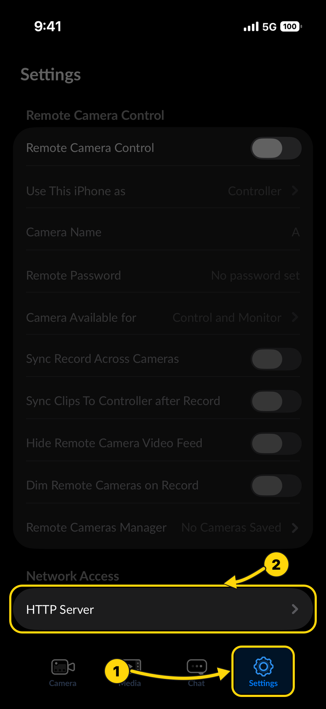
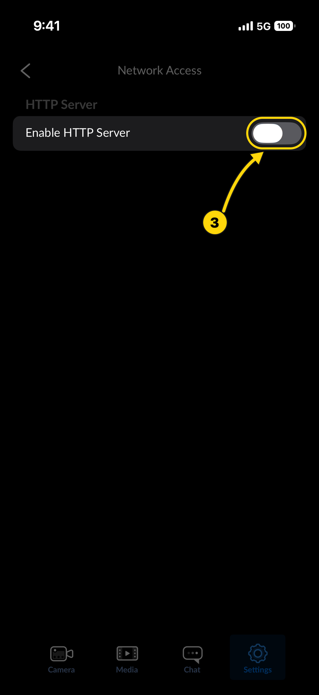
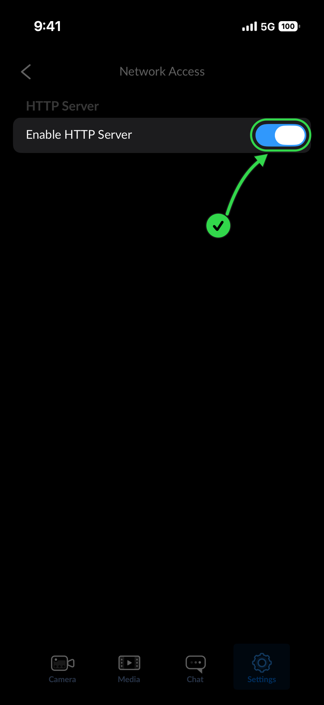

# Setup

From nothing to your iPhone live in OBS. You do the phone part once; after that, opening Blackmagic Camera is enough.

## What you need

- OBS Studio 32.2 or newer on Windows 10 or 11 (x64), macOS 12 or newer (Apple Silicon or Intel), or Ubuntu 24.04 (x64).
- An iPhone with **Blackmagic Camera 3.4 or newer** (free on the App Store). Remote control arrived in 3.4.
- The iPhone and the computer on the same network. 5 GHz Wi-Fi works best. Guest networks usually block devices from seeing each other. Connecting the computer to the iPhone's Personal Hotspot also works.

## 1. Install the plugin

Download the file for your system from the [releases page](https://github.com/solid174/obs-bmagicam/releases), close OBS, then:

| System | File | Install |
| --- | --- | --- |
| Windows | `obs-bmagicam-<version>-windows-x64.exe` | Run it. It finds OBS and installs into `C:\ProgramData\obs-studio\plugins\obs-bmagicam` |
| Windows, by hand | `obs-bmagicam-<version>-windows-x64.zip` | Unzip into `C:\ProgramData\obs-studio\plugins\` |
| macOS | `obs-bmagicam-<version>-macos-universal.pkg` | Open it and follow the installer |
| Ubuntu | `obs-bmagicam-<version>-x86_64-linux-gnu.deb` | `sudo apt install ./obs-bmagicam-<version>-x86_64-linux-gnu.deb` |

Start OBS. The Tools menu now has **Add iPhone Camera…**.

The macOS package is not signed by an Apple developer yet. If macOS refuses to open it, open System Settings → Privacy & Security, scroll to the message about obs-bmagicam and click **Open Anyway**.

## 2. Prepare the iPhone (once)

1. Install **Blackmagic Camera** from the App Store and open it.
2. Turn on its HTTP server:

   1. Tap **Settings** at the bottom right.
   2. Under Network Access, tap **HTTP Server**.
   3. Turn on **Enable HTTP Server**. The switch turns blue.

   

   
   
   
   

3. When iOS asks whether Blackmagic Camera may find devices on your local network, tap **Allow**. If you tapped Don't Allow earlier: iPhone Settings → Privacy & Security → Local Network → Blackmagic Camera → on.
4. Keep the app open on screen while you stream, and set Auto-Lock to **Never** (iPhone Settings → Display & Brightness → Auto-Lock). iOS stops the app's server when the screen locks or you switch apps. A charger keeps a long stream going.

Under Settings → Remote Camera Control, **Camera Available for** must say **Control and Monitor**, which is the default.

## 3. Let OBS onto the network

The first time OBS talks to the phone, your computer may ask for permission:

| System | You see | Choose |
| --- | --- | --- |
| macOS | "OBS would like to find and connect to devices on your local network" | **Allow**. Changed your mind later: System Settings → Privacy & Security → Local Network → OBS |
| Windows | Windows Defender Firewall asks whether OBS may communicate on networks | **Allow** for private networks. Your Wi-Fi must be set to Private: Settings → Network & internet → Wi-Fi → your network → Private |
| Ubuntu | Nothing | If you run a firewall, open the stream ports: `sudo ufw allow 9710:9719/udp`. Phone discovery needs `avahi-daemon`, which Ubuntu runs by default |

## 4. Add the camera

1. In OBS: **Tools → Add iPhone Camera…**
2. The first page repeats the phone steps and waits for your phone. As soon as it appears, the wizard moves on.
3. Choose the stream preset (1080p60 High is right for most streams; the 4K presets look sharper but add delay and need strong 5 GHz Wi-Fi), a look and, if you like, a Beauty style. Leave **Set up the camera for streaming** on. Hover over any choice to see what it does.
4. **Add Camera** adds it to the current scene, fitted to the canvas, and opens the Camera Controls dock with it. The first time it meets your phone, the plugin saves the phone's current settings, so you can always get them back. The picture appears within a few seconds.

## 5. Adjust the picture

- **View → Docks → Camera Controls** has every camera setting. Changes show in the preview while you drag.
- **Set up for streaming** (the button at the top of the dock) sets a flicker-free shutter, measures exposure and white balance once and holds them, and turns on continuous focus. Run it again if the light changes.
- **Look** gives the picture its style: Natural, Studio, Warm, Vivid, Soft or Cinematic. Adjust it in the Color tab, then **+** to save it as your own.
- **Focus on a spot:** right-click the source → **Interact**, then click where you want sharpness.
- **Advanced** (check box at the top of the dock) shows every camera setting: the histogram, the camera's ISO, shutter, white balance and lens, color, focus, the phone's audio and its own screen. Hover over any control to see what it does.
- **Phone presets** (⋮ menu) saves the camera's settings on the phone under a name and loads them again.

## 6. Smooth skin with Beautify

Beautify smooths skin and keeps eyes, brows, lips, hair and the background sharp. It is an OBS filter, so it works on any video source: the iPhone Camera, a webcam, a capture card or a video.

- **On the iPhone Camera:** the dock's **Beauty** row → **Add Beauty**, then choose a style and move the Beauty slider. The first half of the slider stays natural.
- **On any other source:** right-click it → **Filters** → **+** under Effect Filters → **Beautify**.
- **Styles:** Natural keeps skin real, Soft smooths more and adds a little glow, Glam is the strongest. **Advanced** in the dock, or in the filter's properties, shows the values a style is made of; **Save as style…** keeps your own.
- **Show mask** colors what Beautify treats as skin. If it takes in something else of a skin-like color, such as a wooden table or a tan pet, lower **Mask softness**.
- At 0, or turned off, Beautify leaves the picture exactly as it was and costs nothing.

## 7. Sync a computer microphone

A microphone connected to the computer hears you about half a second before the iPhone's picture shows you. The iPhone's own audio is always in sync: if you use it, mute the computer's microphone in OBS's Audio Mixer and you are done. If you use a computer microphone instead:

1. Mute the iPhone Camera in the Audio Mixer, so viewers hear you once.
2. In the dock's **Computer microphone** row, choose the microphone.
3. Click **Sync** and talk or clap for about 12 seconds, with the iPhone's microphone on in Blackmagic Camera; muted in OBS is fine.
4. The button shows the delay it set, for example **Synced · 412 ms**, as the microphone's Sync Offset (Advanced Audio Properties). **Undo** puts the previous value back.

If it says it could not measure, nothing changed: talk or clap closer to both microphones and try again.

## 8. Reset

In the Camera Controls menu (⋮):

- **Reset to camera defaults** returns every camera setting to how a fresh install of Blackmagic Camera has it.
- **Restore my settings** returns the phone's settings to exactly how they were before obs-bmagicam first touched them. The same settings are also saved on the phone as the preset "Before obs-bmagicam". The phone's own livestream destination and video format come back whenever you remove the iPhone Camera or close OBS.

## Troubleshooting

| What you see | Why | What to do |
| --- | --- | --- |
| The wizard never finds the phone | The app is not on screen, HTTP Server is off, or the phone is on another network | Open Blackmagic Camera, check step 2, and make sure both devices use the same Wi-Fi, not a guest network |
| "Blackmagic Camera only allows monitoring" | Camera Available for is not set to Control and Monitor | In the app: Settings → Remote Camera Control → Camera Available for → Control and Monitor |
| Found, but "Blackmagic Camera isn't answering" | The phone locked or the app went to the background | Unlock the phone and bring the app back; OBS reconnects by itself |
| "The phone streams, but no picture arrives" | Blackmagic Camera shows a message on the phone, the firewall blocks the stream, or the Wi-Fi is set to Public | Answer the message on the phone; otherwise step 3 |
| Found on macOS only after a long wait, or never | OBS was denied local network access | System Settings → Privacy & Security → Local Network → OBS → on, then restart OBS |
| The picture stutters | Weak Wi-Fi or 2.4 GHz | Move closer to the router, use 5 GHz, or connect the computer to the iPhone's hotspot. A lower stream preset also helps |
| Beautify smooths something that is not skin | It has a skin-like color and little texture | Lower Mask softness; Show mask shows what counts as skin |
| The phone gets hot | Long stream with the screen at full brightness | Dock → Phone → Phone screen → Brightness down, and keep the phone out of direct sun |
| "Audio Source Unavailable! … iPhone Microphone has been disconnected" on the phone, and the picture stops | Blackmagic Camera lost the phone's microphone; the cause is not known yet | Tap OK on the phone. OBS reconnects by itself |
| "Update Blackmagic Camera" | App older than 3.4 | Update it from the App Store |

## Uninstall

- Windows: Settings → Apps → obs-bmagicam (OBS Studio plugin) → Uninstall, or delete `C:\ProgramData\obs-studio\plugins\obs-bmagicam`.
- macOS: delete `obs-bmagicam.plugin` from `~/Library/Application Support/obs-studio/plugins`.
- Ubuntu: `sudo apt remove obs-bmagicam`.

Before uninstalling, **Restore my settings** if you want your phone exactly as it was.
